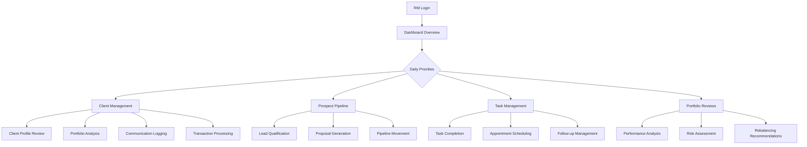
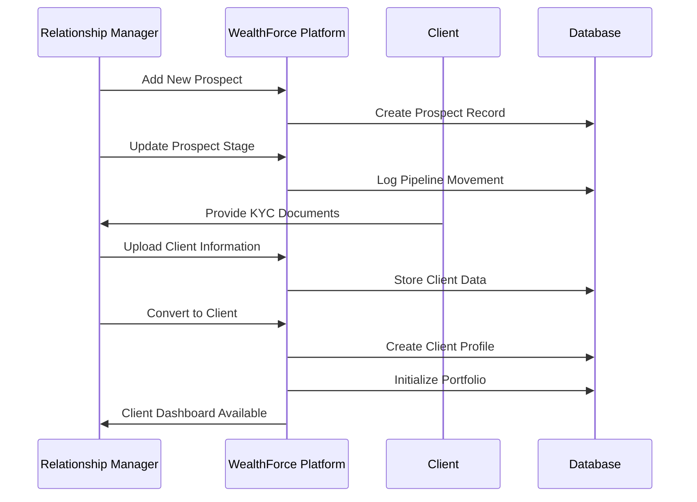
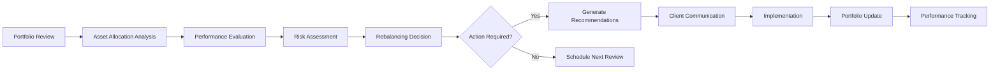

# Intellect WealthForce

A sophisticated wealth management platform designed for Relationship Managers (RMs) at Ujjivan Small Finance Bank, providing intelligent workflow tools and advanced client engagement capabilities.

## 🏗️ Architecture Overview

### Technology Stack
- **Frontend**: React 18 + TypeScript + Vite
- **Backend**: Express.js + TypeScript
- **Database**: PostgreSQL with Drizzle ORM
- **UI Framework**: Tailwind CSS + shadcn/ui components
- **State Management**: TanStack Query v5 for server state
- **Authentication**: Session-based with Passport.js
- **Charts**: Recharts for data visualization

### Project Structure
```
├── client/                    # Frontend React application
│   ├── src/
│   │   ├── components/       # Reusable UI components
│   │   │   ├── ui/          # shadcn/ui components
│   │   │   ├── dashboard/   # Dashboard-specific components
│   │   │   ├── charts/      # Chart components
│   │   │   └── layout/      # Layout components
│   │   ├── pages/           # Application pages/routes
│   │   ├── hooks/           # Custom React hooks
│   │   ├── context/         # React context providers
│   │   └── lib/             # Utility functions and configs
├── server/                   # Backend Express application
│   ├── index.ts            # Main server entry point
│   ├── routes.ts           # API route definitions
│   ├── storage.ts          # Data access layer
│   └── db.ts               # Database configuration
├── shared/                   # Shared types and schemas
│   └── schema.ts           # Drizzle database schemas
└── scripts/                 # Database utilities and seeding
```

## 🎯 Core Functionality

### 1. Dashboard & Business Intelligence
- **Real-time Business Metrics**: AUM tracking, client counts, revenue monitoring
- **Performance Analytics**: Target vs actual tracking with visual indicators
- **Pipeline Management**: Prospect tracking with conversion metrics
- **Action Items**: Prioritized task management with client/prospect linking

### 2. Client Relationship Management
- **360° Client View**: Comprehensive client profiles with personal and financial data
- **Portfolio Management**: Asset allocation, performance tracking, and insights
- **Transaction History**: Detailed transaction logs with categorization
- **Communication Tracking**: Meeting logs, call records, and follow-up management
- **Risk Profiling**: Conservative, Moderate, and Aggressive categorization

### 3. Prospect Pipeline Management
- **Lead Tracking**: Multi-stage pipeline (New → Qualified → Proposal → Won/Lost)
- **Conversion Analytics**: Pipeline velocity and conversion rate tracking
- **Opportunity Scoring**: Probability-based prospect ranking
- **Drag-and-Drop Interface**: Visual pipeline management

### 4. Task & Calendar Management
- **Intelligent Task Assignment**: Client and prospect-linked tasks
- **Calendar Integration**: Appointment scheduling and management
- **Priority-based Organization**: High, Medium, Low priority categorization
- **Due Date Tracking**: Overdue and upcoming task visualization

### 5. Knowledge Management
- **Talking Points**: Market insights and conversation starters
- **Product Catalog**: Comprehensive financial product information
- **Regulatory Updates**: Compliance and policy announcements
- **Training Materials**: RM development resources

## 📊 Use Case Diagrams

### Primary User Journey: Relationship Manager Daily Workflow



### Client Onboarding Process



### Portfolio Management Workflow



## 🏢 Business Context

### Target Users
- **Primary**: Relationship Managers at Ujjivan Small Finance Bank
- **Secondary**: Team Leads and Branch Managers
- **Tertiary**: Compliance and Risk Management Teams

### Key Business Objectives
1. **Client Acquisition**: Streamline prospect-to-client conversion
2. **Portfolio Growth**: Maximize Assets Under Management (AUM)
3. **Client Retention**: Enhance relationship quality through data insights
4. **Operational Efficiency**: Reduce administrative overhead
5. **Compliance**: Ensure regulatory adherence and documentation

### Success Metrics
- **AUM Growth**: Target 25% year-over-year increase
- **Client Acquisition**: 10+ new clients per RM per quarter
- **Portfolio Performance**: Benchmark outperformance tracking
- **Client Satisfaction**: Relationship quality indicators
- **Operational Efficiency**: Task completion rates and time savings

## 🔧 Technical Implementation

### Data Architecture

#### Core Entities
- **Users**: RMs and administrative users
- **Clients**: Individual and institutional investors
- **Prospects**: Potential clients in the pipeline
- **Portfolios**: Investment holdings and allocations
- **Transactions**: All financial activities
- **Tasks**: Action items and follow-ups
- **Communications**: Client interaction history

#### Database Schema Highlights
```sql
-- Core client relationship
clients (id, fullName, email, phone, tier, riskProfile, aum, ...)
prospects (id, fullName, stage, probabilityScore, potentialAum, ...)
transactions (id, clientId, amount, productType, transactionDate, ...)
portfolios (id, clientId, assetAllocation, performance, ...)
```

### API Design Philosophy
- **RESTful Architecture**: Standard HTTP methods and status codes
- **Real-time Data**: All metrics calculated from actual transactions
- **Data Integrity**: Zero tolerance for mock or placeholder data
- **Performance Optimization**: Efficient querying with proper indexing
- **Error Handling**: Comprehensive validation and error responses

### Security Features
- **Session Management**: Secure authentication with session tokens
- **Data Encryption**: Sensitive information protection
- **Access Control**: Role-based permissions
- **Audit Trails**: Complete activity logging
- **Compliance**: GDPR and financial regulations adherence

## 🚀 Deployment & Operations

### Environment Setup
```bash
# Install dependencies
npm install

# Database setup
npm run db:push

# Seed initial data
npm run seed

# Start development server
npm run dev
```

### Production Considerations
- **Scalability**: Horizontal scaling capability
- **Monitoring**: Performance and error tracking
- **Backup Strategy**: Regular database backups
- **Disaster Recovery**: Business continuity planning
- **Performance Optimization**: Query optimization and caching

## 📈 Future Roadmap

### Phase 1: Core Platform (Current)
- ✅ Client and prospect management
- ✅ Portfolio tracking and analytics
- ✅ Task and calendar management
- ✅ Basic reporting and insights

### Phase 2: Advanced Analytics
- 🔄 Predictive analytics for client needs
- 🔄 Advanced risk modeling
- 🔄 Automated rebalancing suggestions
- 🔄 Performance attribution analysis

### Phase 3: Digital Integration
- 📋 Mobile application development
- 📋 Third-party financial data integration
- 📋 Automated client communication
- 📋 Advanced workflow automation

### Phase 4: AI & Machine Learning
- 📋 Client behavior prediction
- 📋 Personalized investment recommendations
- 📋 Natural language processing for insights
- 📋 Intelligent document processing

## 🤝 Contributing

### Development Guidelines
1. **Code Quality**: TypeScript strict mode, ESLint compliance
2. **Testing**: Comprehensive unit and integration tests
3. **Documentation**: Clear code comments and API documentation
4. **Performance**: Optimized queries and efficient algorithms
5. **Security**: Regular security audits and updates

### Data Integrity Standards
- All financial data sourced from authenticated APIs
- Real-time calculation of all metrics and KPIs
- Zero reliance on hardcoded or synthetic data
- Comprehensive audit trails for all data changes
- Regular data validation and consistency checks

---

**Built with ❤️ for Ujjivan Small Finance Bank Relationship Managers**

*Empowering wealth management through intelligent technology and data-driven insights.*