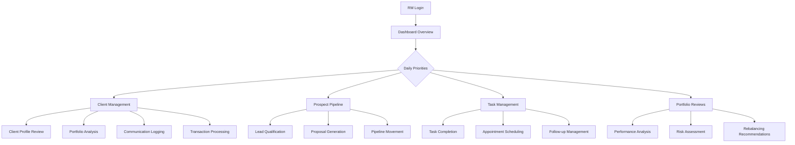
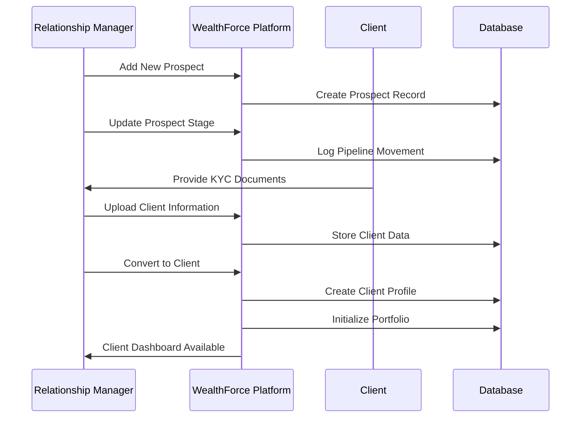
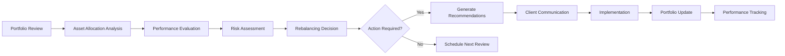

# Wealth Management System

A sophisticated wealth management platform designed for Relationship Managers (RMs) at ABC Bank, providing intelligent workflow tools and advanced client engagement capabilities.

## 🏗️ Architecture Overview

### Technology Stack
- **Frontend**: React 18 + TypeScript + Vite
- **Backend**: Express.js + TypeScript
- **Database**: Supabase (PostgreSQL) with Drizzle ORM
- **Backend SDK**: Supabase JS SDK (@supabase/supabase-js)
- **UI Framework**: Tailwind CSS + shadcn/ui components
- **State Management**: TanStack Query v5 for server state
- **Authentication**: Session-based authentication
- **Charts**: Recharts for data visualization
- **Security**: Row-Level Security (RLS) policies enabled

### Project Structure
```
├── client/                    # Frontend React application
│   ├── src/
│   │   ├── components/       # Reusable UI components
│   │   │   ├── ui/          # shadcn/ui components
│   │   │   ├── dashboard/   # Dashboard-specific components
│   │   │   ├── charts/      # Chart components
│   │   │   └── layout/      # Layout components
│   │   ├── pages/           # Application pages/routes
│   │   ├── hooks/           # Custom React hooks
│   │   ├── context/         # React context providers
│   │   └── lib/             # Utility functions and configs
├── server/                   # Backend Express application
│   ├── index.ts            # Main server entry point
│   ├── routes.ts           # API route definitions
│   ├── routes/             # Route modules (clients, etc.)
│   ├── storage.ts          # Data access layer
│   ├── db.ts               # Database configuration
│   └── lib/                # Server utilities (Supabase client)
├── shared/                   # Shared types and schemas
│   └── schema.ts           # Drizzle database schemas
├── scripts/                 # Database utilities and seeding
├── docs/                    # Project documentation
│   ├── database-schema.dbml # Database schema visualization
│   ├── RLS-POLICIES.md     # Row-Level Security documentation
│   └── TEAM-WORKFLOW.md    # Team collaboration guide
└── documents/               # Business requirement documents
```

## ✨ Key Features

### Client Management
- **Complete Client Profiles**: Personal information, financial profiling, risk assessment
- **Draft System**: Save incomplete client profiles and resume later
- **Profile Completion Tracking**: Identify incomplete profiles with section-by-section status
- **Financial Profiling**: Comprehensive income, expenses, assets, and liabilities tracking
- **Financial Summary**: Visual charts for asset allocation, cashflow, and net worth projection

### Security & Access Control
- **Row-Level Security (RLS)**: Database-level access control for all tables
- **Role-Based Access**: Relationship Managers, Supervisors, and Admin roles
- **Data Isolation**: RMs can only access their assigned clients and data
- **Audit Trail**: Complete tracking of all data modifications

## 🎯 Core Functionality

### 1. Dashboard & Business Intelligence
- **Real-time Business Metrics**: AUM tracking, client counts, revenue monitoring
- **Performance Analytics**: Target vs actual tracking with visual indicators
- **Pipeline Management**: Prospect tracking with conversion metrics
- **Action Items**: Prioritized task management with client/prospect linking

### 2. Client Relationship Management
- **360° Client View**: Comprehensive client profiles with personal and financial data
- **Portfolio Management**: Asset allocation, performance tracking, and insights
- **Transaction History**: Detailed transaction logs with categorization
- **Communication Tracking**: Meeting logs, call records, and follow-up management
- **Risk Profiling**: Conservative, Moderate, and Aggressive categorization

### 3. Prospect Pipeline Management
- **Lead Tracking**: Multi-stage pipeline (New → Qualified → Proposal → Won/Lost)
- **Conversion Analytics**: Pipeline velocity and conversion rate tracking
- **Opportunity Scoring**: Probability-based prospect ranking
- **Drag-and-Drop Interface**: Visual pipeline management

### 4. Task & Calendar Management
- **Intelligent Task Assignment**: Client and prospect-linked tasks
- **Calendar Integration**: Appointment scheduling and management
- **Priority-based Organization**: High, Medium, Low priority categorization
- **Due Date Tracking**: Overdue and upcoming task visualization

### 5. Knowledge Management
- **Talking Points**: Market insights and conversation starters
- **Product Catalog**: Comprehensive financial product information
- **Regulatory Updates**: Compliance and policy announcements
- **Training Materials**: RM development resources

## 📊 Use Case Diagrams

### Primary User Journey: Relationship Manager Daily Workflow



### Client Onboarding Process



### Portfolio Management Workflow



## 🏢 Business Context

### Target Users
- **Primary**: Relationship Managers at ABC Bank
- **Secondary**: Team Leads and Branch Managers
- **Tertiary**: Compliance and Risk Management Teams

### Key Business Objectives
1. **Client Acquisition**: Streamline prospect-to-client conversion
2. **Portfolio Growth**: Maximize Assets Under Management (AUM)
3. **Client Retention**: Enhance relationship quality through data insights
4. **Operational Efficiency**: Reduce administrative overhead
5. **Compliance**: Ensure regulatory adherence and documentation

### Success Metrics
- **AUM Growth**: Target 25% year-over-year increase
- **Client Acquisition**: 10+ new clients per RM per quarter
- **Portfolio Performance**: Benchmark outperformance tracking
- **Client Satisfaction**: Relationship quality indicators
- **Operational Efficiency**: Task completion rates and time savings

## 🔧 Technical Implementation

### Data Architecture

#### Core Entities
- **Users**: RMs and administrative users
- **Clients**: Individual and institutional investors
- **Prospects**: Potential clients in the pipeline
- **Portfolios**: Investment holdings and allocations
- **Transactions**: All financial activities
- **Tasks**: Action items and follow-ups
- **Communications**: Client interaction history

#### Database Schema Highlights
```sql
-- Core client relationship
clients (id, fullName, email, phone, tier, riskProfile, aum, ...)
prospects (id, fullName, stage, probabilityScore, potentialAum, ...)
transactions (id, clientId, amount, productType, transactionDate, ...)
portfolios (id, clientId, assetAllocation, performance, ...)
```

### API Design Philosophy
- **RESTful Architecture**: Standard HTTP methods and status codes
- **Real-time Data**: All metrics calculated from actual transactions
- **Data Integrity**: Zero tolerance for mock or placeholder data
- **Performance Optimization**: Efficient querying with proper indexing
- **Error Handling**: Comprehensive validation and error responses

### Security Features
- **Session Management**: Secure authentication with session tokens
- **Data Encryption**: Sensitive information protection
- **Access Control**: Role-based permissions
- **Audit Trails**: Complete activity logging
- **Compliance**: GDPR and financial regulations adherence

## 🚀 Deployment & Operations

### Environment Setup

1. **Clone the repository**
   ```bash
   git clone https://github.com/bkalva-psi/wealthrm-app.git
   cd wealthrm-app
   ```

2. **Install dependencies**
   ```bash
   npm install
   ```

3. **Configure environment variables**
   
   Create a `.env` file in the root directory:
   ```env
   # Supabase Configuration
   SUPABASE_URL=https://your-project.supabase.co
   SUPABASE_SERVICE_ROLE_KEY=your-service-role-key
   
   # Frontend Supabase (Public)
   NEXT_PUBLIC_SUPABASE_URL=https://your-project.supabase.co
   NEXT_PUBLIC_SUPABASE_ANON_KEY=your-anon-key
   
   # Server Configuration
   NODE_ENV=development
   PORT=5000
   
   # Session Secret (generate a random string)
   SESSION_SECRET=your-session-secret
   ```

4. **Start development server**
   ```bash
   npm run dev
   ```

5. **Access the application**
   - Frontend: http://localhost:5000
   - Backend API: http://localhost:5000/api

### Database Setup

The project uses Supabase (PostgreSQL) with:
- **Row-Level Security (RLS)** policies enabled for all tables
- **Drizzle ORM** for type-safe database operations
- **Supabase JS SDK** for backend and frontend interactions

See `docs/database-schema.dbml` for complete database schema and `docs/RLS-POLICIES.md` for security policies.

### Production Considerations
- **Scalability**: Horizontal scaling capability
- **Monitoring**: Performance and error tracking
- **Backup Strategy**: Regular database backups
- **Disaster Recovery**: Business continuity planning
- **Performance Optimization**: Query optimization and caching

## 📈 Future Roadmap

### Phase 1: Core Platform (Current)
- ✅ Client and prospect management
- ✅ Portfolio tracking and analytics
- ✅ Task and calendar management
- ✅ Basic reporting and insights

### Phase 2: Advanced Analytics
- 🔄 Predictive analytics for client needs
- 🔄 Advanced risk modeling
- 🔄 Automated rebalancing suggestions
- 🔄 Performance attribution analysis

### Phase 3: Digital Integration
- 📋 Mobile application development
- 📋 Third-party financial data integration
- 📋 Automated client communication
- 📋 Advanced workflow automation

### Phase 4: AI & Machine Learning
- 📋 Client behavior prediction
- 📋 Personalized investment recommendations
- 📋 Natural language processing for insights
- 📋 Intelligent document processing

## 🤝 Contributing

### Development Guidelines
1. **Code Quality**: TypeScript strict mode, ESLint compliance
2. **Testing**: Comprehensive unit and integration tests
3. **Documentation**: Clear code comments and API documentation
4. **Performance**: Optimized queries and efficient algorithms
5. **Security**: Regular security audits and updates

### Data Integrity Standards
- All financial data sourced from authenticated APIs
- Real-time calculation of all metrics and KPIs
- Zero reliance on hardcoded or synthetic data
- Comprehensive audit trails for all data changes
- Regular data validation and consistency checks

---

**Built with ❤️ for ABC Bank Relationship Managers**

*Empowering wealth management through intelligent technology and data-driven insights.*